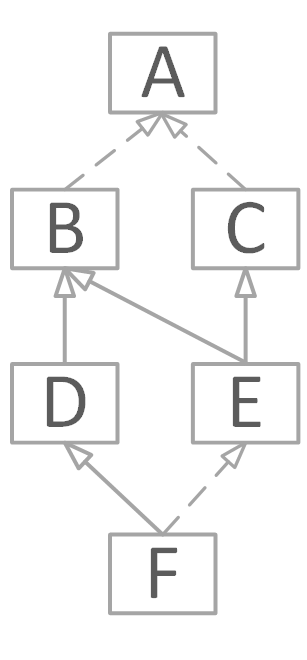

### **任务：求10个数中最大值最小值**

认真阅读下面要求，完成本次任务代码的编写。

**问题描述：**

求10个数中的最大最小值。

**程序要求：**

用 C++（使用cout和cin）实现，要将功能封装到函数,原型为:

``` cpp
void maxMinValue(int *arr,int n)
```
**运行效果：**

```
Please input 10 number: 1 2 3 4 5 6 7 8 9 10

Max is :10

Min is :1
```

### **任务：内存空间管理**

认真阅读下面要求，完成本次任务代码的编写。

**问题描述：**

用户输入一个整数n，然后再输入n个字符串，最后将这n个字符串按与输入相反的顺序输出。运行结果如图所示。

**程序要求：**

程序中字符串数量由用户输入，保存字符串使用string类型，堆区内存申请释放使用new、delete运算符完成。

**运行效果：**

```
请输入字符串个数: 4
请输入4个字符串
guanyu
zhangfei
machao
zhaoyun
输入完毕,现在反序输出
zhaoyun
machao
zhangfei
guanyu
```
### **任务：函数重载**

认真阅读下面要求，完成本次任务代码的编写。

**问题描述：**

用函数重载方法写三种类型的加法函数（int，double，string），并将相加后的结果进行返回。

**程序要求：**

main函数中需完成对三个重载函数的调用，并将返回结果进行打印。

### **任务：数值交换**

认真阅读下面要求，完成本次任务代码的编写。

**问题描述：**

编写函数实现交换两个数，形参分别用指针及引用完成。

**程序要求：**

交换的过程写在函数exchange中，要求实现指针做参数及引用做参数两种数值交换的方法。

### **任务：动物类**

认真阅读下面要求，完成本次任务代码的编写。

**问题描述：**                                          

动物属性有：
- 动物名称：dog
- 动物性别：male
- 动物颜色：yellow
- 动物叫声：wangwang

请你编写自己的动物类，能够满足下面的要求。

**程序要求：**

 - 动物的名字、性别、颜色、叫声属性均为私有属性。
 - 需提供设置修改动物的名字、性别、颜色、叫声的接口方法。
 - 需提供打印输出动物信息的接口方法。
 - 类名必须为Animal。

### **任务：圆形类**

认真阅读下面要求，完成本次任务代码的编写。

**问题描述：**                                      

按如下要求编写代码完成一个圆形类的定义及使用代码。

**程序要求：**

 - 属性成员包括圆心坐标，圆半径，均设置为私有。
 - 提供设置圆心坐标及圆半径的公有方法。
 - 提供获取当前圆对象面积的公有方法。
 - 提供获取当前圆对象周长的公有方法。
 - 提供圆信息打印的公有方法，包括圆心坐标、半径、周长、面积信息。

### **任务：通讯录**

认真阅读下面要求，完成本次任务代码的编写。

**问题描述：**

根据如下两个类声明（信息类、通讯录类），完成两个类的定义代码。

**程序要求：**

- 认真读取注释信息，按照注释信息完成每一个成员函数的编码。
- 两个类定义完成后，通过main函数中的测试代码能够正常运行并正确输出。
- 编码时请认真回顾近几周所学内容，作业禁止出现抄袭。

**声明代码：**

``` cpp
// 信息类
class Info
{
public:
    Info(string name="", string phone="", string address="");
    // 设置姓名
    void setName(string name);
    // 设置电话
    void setPhone(string phone);
    // 设置地址
    void setAddress(string address);
    // 获取姓名
    string getName();
    // 获取电话号
    string getPhone();
    // 获取地址
    string getAddress();
private:
    string m_Name;   // 姓名
    string m_Phone;  // 电话
    string m_Address;// 地址
};

class AddressBook
{
public:
    // 需在构造函数中根据size动态创建存放信息的数组内存
    AddressBook(int size = 10);
    // 需在析构函数中对构造函数中动态申请的内存进行释放
    ~AddressBook();

    // 通讯录中添加信息，添加成功返回true，失败返回false
    // 成功失败依据为是否查过通讯录最大长度
    bool addInfo(Info * pInfo);
    // 介绍同上
    bool addInfo(Info & info);

    // 根据姓名查找信息，返回匹配信息的下标，没有匹配返回-1
    int findInfoByName(string name);
    // 根据电话查找信息，返回匹配信息的下标，没有匹配返回-1
    int findInfoByPhone(string phone);

    // 根据下标获取信息，注意返回值为引用
    Info & at(int index);

    // 获取当前信息数量
    int getCurCound();

    // 打印当前所有信息
    void printAllInfo();
    // 根据姓名打印信息
    void printInfoByName(string name);
    // 根据电话打印信息
    void printInfoByPhone(string phone);

private:
    int m_CurCount;       // 当前通讯录信息个数
    const int m_MaxSize;  // 通讯录最大长度长度
    Info * m_pArr;        // 指向堆区存放信息的数组内存
};
```
**测试代码：**

``` cpp
int main(void) 
{  
    AddressBook book(5);
    Info info1("关羽", "13900000001", "河东郡解县");
    Info info2("张飞", "13900000002", "幽州涿郡");
    Info info3("赵云", "13966666666", "常山真定");

    book.addInfo(info1);
    book.addInfo(info2);
    book.addInfo(&info3);

    book.printAllInfo();
    int index = book.findInfoByName("赵云");
    if(index != -1)
        book.at(index).setPhone("13988888888");

    book.printInfoByName("赵云");
    book.printInfoByPhone("13888888888");

    cout << "当前信息数量：" << book.getCurCound() << endl;

    return 0;
}
```
### **任务：修改雇员信息**

认真阅读下面要求，完成本次任务代码的编写。

**问题描述：**

公司中有雇主（Employer）、雇员（Employee），根据程序要求定义实现两个类，本任务要求两种方法实现！

- 雇主信息有姓名（Name）。
- 雇员信息包括工号（ID）、姓名（Name）、薪资（Salary）、岗位（Post）。

**程序要求：**

- 在实现两个类时，类的属性成员初始值均通过构造函数进行赋值。
- 每个类的属性成员均设置成为private私有成员。
- 雇主类需提供public公有方法editEmployee（Employee & person, double salary, string post）完成对雇员薪资及岗位的修改。

本任务实现时需根据下面两种方法分别实现两遍。

- 方法一：通过在雇员类提供相应接口实现。
- 方法二：通过在雇员类中将雇主类的editEmployee方法设为友元函数实现。

编码时请认真回顾近几周所学内容，作业禁止出现抄袭。

### **任务：公司员工管理**

认真阅读下面要求，完成本次任务代码的编写。

**问题描述：**

公司有两类职员Employee 和Manager，Manager 是一种特殊的Employee。

每个 Employee 对象所具有的基本信息为：
- 姓名（Name）
- 年龄（Age）
- 薪资（Salary）

Manager 对象除具有上述基本信息外，还有级别(Level)信息。

公司中的两类职员都具有两种基本操作：

- printOn() // 输出Employee/Manager 对象的个人信息。
- retire() // 判断是否到了退休年令，是返回true，不是返回false。公司规定： Employee 类对象的退休年令为55 岁，Manager 类对象的退休年令为60 岁。

**程序要求：**

- 定义并实现类Employee 和Manager。
- 两个类的属性成员初始值均通过构造函数进行赋值。
- 注意类Employee 和Manager之间的关系。
- 编码时请认真回顾近几周所学内容，作业禁止出现抄袭。

### **任务：汽车类**

认真阅读下面要求，完成本次任务代码的编写。

**问题描述：**

编写一个程序，有一个车辆类（Vehicle），它具有有参构造函数，类中的数据成员 车轮个数（wheels） 和 车重（weight） 访问权限为protected。

编写一个引擎类（Engine），可以抽象出排量信息（displacement）作为成员变量，调整排量（setDisplacement）作为成员函数。

小车类（Car）是车辆类（Vehicle）的公有派生类，是引擎类的私有派生类，其中包含车载人数（passenger_load）。

卡车类（Truck）是车辆类（Vehicle）的保护派生类，是引擎的私有派生类，其中包含车载人数（passenger_load）和载重量（payload）。每个类都有相关数据的输入方法。

**程序要求：**

- 定义并实现上述所有类。
- 每个类均需提供构造函数进行属性成员的初始化。
- 每个类需提供相关属性成员的set设置方法。
- 注意类与类之间的关系。
- 编码时请认真回顾近几周所学内容，作业禁止出现抄袭。


### **任务：虚基类构造与析构**

认真阅读下面要求，完成本次任务代码的编写。

**问题描述：**

  根据下面继承关系图，给出类F对象的构造析构顺序。

  注意：实线表示普通继承，虚线表示虚继承。



### **任务：输入输出运算符重载**

认真阅读下面要求，完成本次任务代码的编写。

**问题描述：**

现有如下代码，要求对学生类进行输入输出运算符重载，对下面代码进行补全，使代码能够正常运行 。

``` cpp
#include <iostream>
#include <string>
using namespace std;

class Student 
{
public:
    Student(string name, int age)
        : mName(name), mAge(age)
    {}
private:
    string mName;
    int mAge;
};

int main(void) 
{
    Student s("李四", 19);
    cout << s << endl;
    cin >> s;
    cout << s << endl;
    return 0;
}

```

### **任务：链表**

认真阅读下面要求，完成本次任务代码的编写。

**问题描述：**

现有如下代码，对代码进行补全，使其能够正常运行。

**程序要求：**

- 完成析构函数，释放所有节点内存。
- 完成拷贝构造函数，要求进行深拷贝。
- 完成赋值运算符重载，要求进行深拷贝。
- 完成插入数据操作，也就是插入新节点，形参数据为新节点数据。
- 完成下表运算符重载，能够根据下标获取相应节点的数据。

``` cpp
#include <iostream>
#include <string>
using namespace std;

class Node
{
public:
    Node * next;
    int data;
};

class List 
{
public:
    List()
    {
        head = NULL;
        count = 0;
    }
    List(const List& list);
    ~List();

    void insert(int value);

    List& operator=(const List& list);
    int& operator[](const int index);
private:
    Node * head;
    int count;
};

int main(void) 
{
    List list;
    list.insert(10);
    list.insert(20);
    list.insert(30);
    list.insert(40);
    cout << list[1] << endl;    // 输出20

    return 0;
}

```